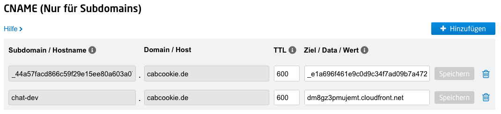

# Bedrock Claude Chat


This repository is a sample chatbot using the Anthropic company's LLM [Claude 2](https://www.anthropic.com/index/claude-2) and [Claude Instant](https://www.anthropic.com/index/releasing-claude-instant-1-2), 2 of the foundational models provided by [Amazon Bedrock](https://aws.amazon.com/bedrock/) for generative AI.


## Deploy using CDK

This section describes the procedure for deploying the chat bot using CDK (the Cloud Development Kit).

This video explains the deployment step by step:

[](https://youtu.be/XVj8b_Hhxwk)

- Enable access to Claude model on Bedrock

Open [Bedrock Model access](https://us-east-1.console.aws.amazon.com/bedrock/home?region=us-east-1#/modelaccess) > `Edit` > Check `Claude` and `Save changes`

- Please have UNIX and a Node.js runtime environment. If not, you can also use [Cloud9](https://github.com/aws-samples/cloud9-setup-for-prototyping)
- Clone this repository

```bash
git clone https://github.com/cabcookie/bedrock-claude-chat.git
```

- Install npm packages

```
cd bedrock-claude-chat
cd cdk
npm ci
```

- Install [AWS CDK](https://aws.amazon.com/cdk/)

```
npm i -g aws-cdk
```

- Configure access to AWS Account

You need to be signed in to the appropriate AWS account before you run the deployment. If you are not sure how to sign in to your AWS account from the command line, read [Configure the AWS CLI](https://docs.aws.amazon.com/cli/latest/userguide/cli-chap-configure.html).

- Before deploying the CDK, you will need to work with Bootstrap once for the region you are deploying to. In this example, we will deploy to the us-east-1 region. Please replace your account id into `<account id>`.

```
cdk bootstrap aws://<account id>/us-east-1
```

- Edit the following entries in [cdk.json](./cdk/cdk.json) according to your preferences.

  - `bedrockRegion`: Region where Bedrock is available. **NOTE: Bedrock does NOT support all regions for now.**
  - `domainAlias`: Provide a domain name like `chat.myorganization.com`. Please be aware that you need to adjust certain DNS settings with your domain provider (see more details below). Please refer to [Setting up a domain alias](#setting-up-a-domain-alias) for more details
  - `allowedIpV4AddressRanges`, `allowedIpV6AddressRanges`: Allowed IP Address range.

- Deploy this sample project

```
cdk deploy --all
```

The script may stop at the stage `AWS::CertificateManager::Certificate` if you configured a `domainAlias` in the `cdk.json`. Please refer to [Setting up a domain alias](#setting-up-a-domain-alias) for more details.

- You will get output similar to the following. The URL of the web app will be output in `BedrockChatStack.FrontendURL`, so please access it from your browser.

```sh
 ✅  BedrockChatStack

✨  Deployment time: 78.57s

Outputs:
BedrockChatStack.AuthUserPoolClientIdXXXXX = xxxxxxx
BedrockChatStack.AuthUserPoolIdXXXXXX = us-east-1_XXXX
BedrockChatStack.BackendApiBackendApiUrlXXXXX = https://xxxxx.execute-api.us-east-1.amazonaws.com
BedrockChatStack.DomainAliasURL = https://chat.myorganization.com
BedrockChatStack.FrontendURL = https://xxxxx.cloudfront.net
```

## 📚 Supported Languages

- English 💬
- 日本語 💬
- 한국어 💬
- 中文 💬

## Use the chat bot

Visit the page `https://chat.myorganization.com` (mentioned in `BedrockChatStack.DomainAliasURL`) or `https://xxxxx.cloudfront.net` (mentioned in `BedrockChatStack.FrontendURL`).


The sign-up screen will appear as shown above, where you can register your email and log in.

> **Important**
> This deployment method allows anyone with the URL to sign up. For production use, we strongly recommend adding IP address restrictions or disabling self-signup to mitigate security risks. Read more on how to [Disable self sign up](#disable-self-sign-up).

## Setting up a domain alias

If you configured a `domainAlias` in the `cdk.json` the deployment will stop at the stage `AWS::CertificateManager::Certificate`. You need to visit your domain service provider and configure a DNS entry to confirm you own the domain. Please visit [AWS Certificate Manager](https://us-east-1.console.aws.amazon.com/acm/home?region=us-east-1#/certificates/list). You will find the domain alias in the list in the status `Pending validation`. It indicates that the Certificate Manager is validating domain ownership.

If I click on the Certificate ID I can see the `CNAME name` and the `CNAME value` the Certificate Manger is looking for:


I need to set those values in my DNS settings at my domain provider:



It takes a couple of minutes until the status changes to `Issued`.

Please find more details in [this documentation](https://docs.aws.amazon.com/acm/latest/userguide/domain-ownership-validation.html).

## Architecture

It's an architecture built on AWS managed services, eliminating the need for infrastructure management. Utilizing Amazon Bedrock, there's no need to communicate with APIs outside of AWS. This enables deploying scalable, reliable, and secure applications.

- [Amazon DynamoDB](https://aws.amazon.com/dynamodb/): NoSQL database for conversation history storage
- [Amazon API Gateway](https://aws.amazon.com/api-gateway/) + [AWS Lambda](https://aws.amazon.com/lambda/): Backend API endpoint ([AWS Lambda Web Adapter](https://github.com/awslabs/aws-lambda-web-adapter), [FastAPI](https://fastapi.tiangolo.com/))
- [Amazon SNS](https://aws.amazon.com/sns/): Used to decouple streaming calls between API Gateway and Bedrock because streaming responses can take over 30 seconds in total, exceeding the limitations of HTTP integration (See [quota](https://docs.aws.amazon.com/apigateway/latest/developerguide/limits.html)).
- [Amazon CloudFront](https://aws.amazon.com/cloudfront/) + [S3](https://aws.amazon.com/s3/): Frontend application delivery ([React](https://react.dev/), [Tailwind CSS](https://tailwindcss.com/))
- [AWS WAF](https://aws.amazon.com/waf/): IP address restriction
- [Amazon Cognito](https://aws.amazon.com/cognito/): User authentication
- [Amazon Bedrock](https://aws.amazon.com/bedrock/): Managed service to utilize foundational models via APIs


## Features and Roadmap

- [x] Authentication (Sign-up, Sign-in)
- [x] Creation, storage, and deletion of conversations
- [x] Copying of chatbot replies
- [x] Automatic subject suggestion for conversations
- [x] Syntax highlighting for code
- [x] Rendering of Markdown
- [x] Streaming Response
- [x] IP address restriction
- [x] Edit message & re-send
- [x] I18n
- [x] Model switch (Claude Instant / Claude)
- [ ] Save and re-use prompt template

## Others

### Configure text generation parameters

Edit [config.py](./backend/app/config.py) and run `cdk deploy`.

```py
GENERATION_CONFIG = {
    "max_tokens_to_sample": 500,
    "temperature": 0.6,
    "top_k": 250,
    "top_p": 0.999,
    "stop_sequences": ["Human: ", "Assistant: "],
}
```

### Remove resources

If using cli and CDK, please `cdk destroy`. If not, access to [CloudFormation](https://console.aws.amazon.com/cloudformation/home) then delete `BedrockChatStack` and `FrontendWafStack` manually. Please note that `FrontendWafStack` is on `us-east-1` region.

### Language Settings

This asset automatically detects the language using [i18next-browser-languageDetector](https://github.com/i18next/i18next-browser-languageDetector).You can switch languages from the application menu. Alternatively, you can use Query String to set the language as shown below.

> `https://example.com?lng=ja`

### Disable self sign up

This sample has self sign up enabled by default. To disable self sign up, open [auth.ts](./cdk/lib/constructs/auth.ts) and switch `selfSignUpEnabled` as `false`, then re-deploy.

```ts
const userPool = new UserPool(this, "UserPool", {
  passwordPolicy: {
    requireUppercase: true,
    requireSymbols: true,
    requireDigits: true,
    minLength: 8,
  },
  // true -> false
  selfSignUpEnabled: false,
  signInAliases: {
    username: false,
    email: true,
  },
});
```

### Local Development

See [LOCAL DEVELOPMENT](./docs/LOCAL_DEVELOPMENT.md).

### Contribution

Thank you for considering contribution on this repository! We welcome for bug fixes, language translation, feature enhancements, and other improvements. Please see following:

- [Local Development](./docs/LOCAL_DEVELOPMENT.md)
- [CONTRIBUTING](./CONTRIBUTING.md)

### RAG using Kendra

In this sample, we have not implemented RAG using Kendra. This is because when it comes to real-world deployments, factors such as access control policies, the presence or absence of data connectors, and the methods for authentication and authorization for the connected data sources can be quite diverse depending on the organization, making it difficult to generalize them in a simple manner. To put this into practice, you should consider downsides like decreased latency and increased token consumption. For these reasons, a proof of concept (PoC) to verify search accuracy is essential.

- [generative-ai-use-cases-jp](https://github.com/aws-samples/generative-ai-use-cases-jp) (In Japanese)
- [simple-lex-kendra-jp](https://github.com/aws-samples/simple-lex-kendra-jp) (In Japanese)
- [jp-rag-sample](https://github.com/aws-samples/jp-rag-sample) (In Japanese)

## Authors

- [Takehiro Suzuki](https://github.com/statefb)
- [Yusuke Wada](https://github.com/wadabee)

## License

This library is licensed under the MIT-0 License. See the LICENSE file.
